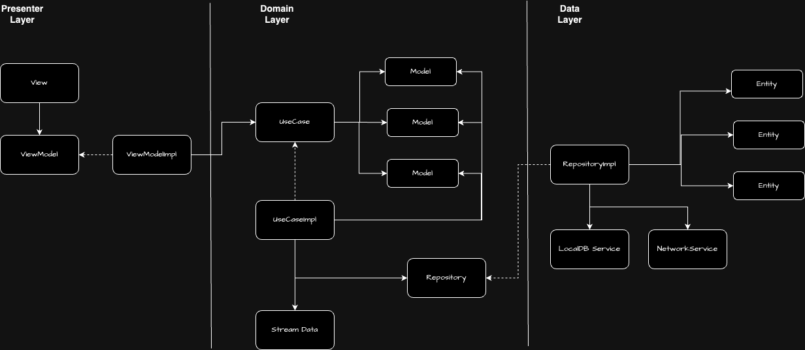
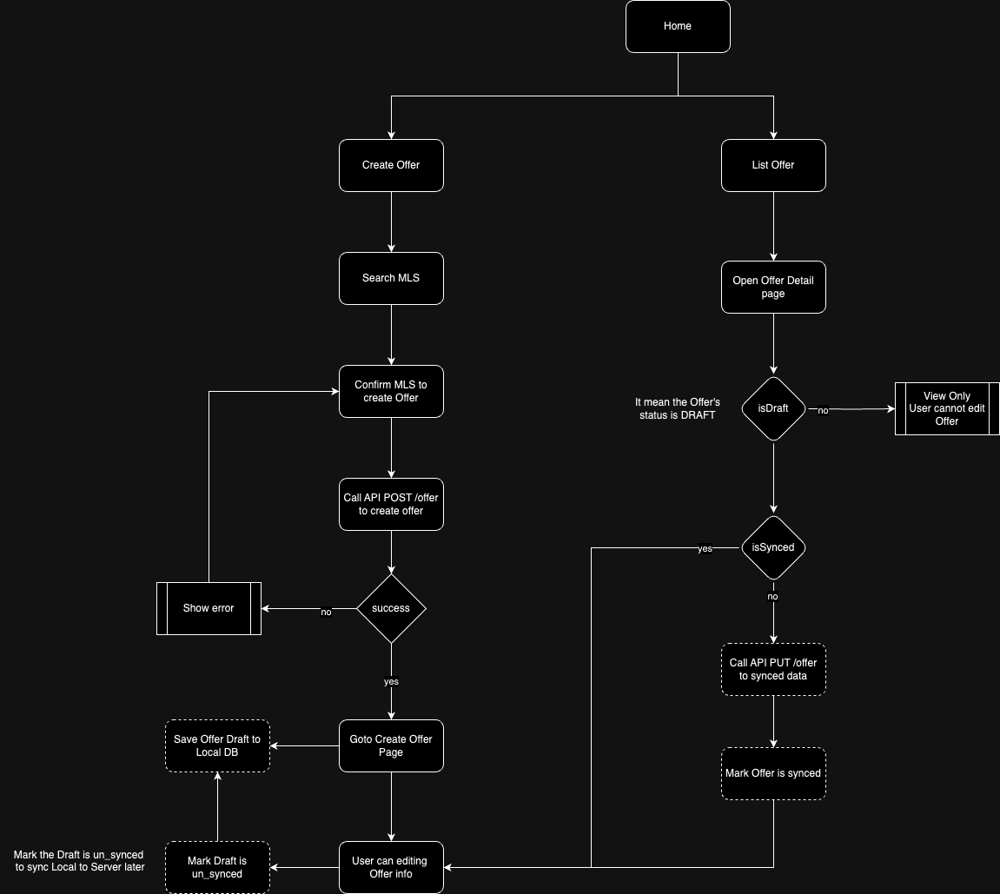

# 1. Offeright Architecture
### a. Overview


### b. Description
#### Offeright adopts Clean Architecture with three layers:

- `Presenter layer`: Responsible for managing the UI/UX of the application using the MVVM architecture.
- `Domain layer`: Manages the business logic of the application.
- `Data layer`: Handles data requests to the network, storage to local database, etc.
`Presenter layer` ONLY has access to the `Domain layer`, and the `Domain layer` ONLY has access to the `Data layer`.

#### Presenter layer

- Utilizes MVVM architecture.
- Employs SwiftUI for building layouts.
- Uses Combine for binding data to render layouts.

#### Domain layer

- Defines `UseCase` as the protocol to specify all connections from the Presenter layer.
- Defines `UseCaseImpl` as an implementation object to handle business logic for these use cases.
- The `Model` represents the object ready for use in logic and presentation to layouts in the Presenter layer.
- The `Stream data` manages reactive stream data for all application logic.
- The `Repository` is the protocol that defines all connections from the Domain layer.

#### Data layer

- `RepositoryImpl` serves as the implementation object to handle data requests from the Domain Layer.
- `Entity` represents raw objects fetched from network services or local database services, etc.
- `NetworkService` manages all requests to network APIs.
- `LocalDBService` manages storing/getting/updating user data to the local disk.


# 2. Offer Create Logic



# 3. Deploy App
Deploy dev to CH Play
1. Go to the root folder of the project
2. Run the command
```fastlane deploy env:<env-value>```
   
    Replace `<env-value>` with the environment you want to deploy:
    - dev
    - staging
    - prod
3. The app will be deployed to the CH Play store